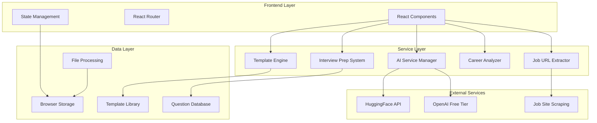

# Design Document

## Overview

The Career Acceleration Platform transforms Resume Fit Codenex from a basic ATS checker into a comprehensive career development ecosystem. The platform will provide five core features that eliminate user friction, offer personalized career guidance, and deliver comprehensive job preparation tools. The architecture emphasizes modularity, scalability, and user experience while maintaining the existing React/Vite foundation.

## Architecture

### High-Level System Architecture



### Technology Stack Enhancement

**Existing Stack (Maintained):**
- React 18.3.1 with Vite
- Tailwind CSS + Radix UI components
- Framer Motion for animations
- React Router for navigation

**New Dependencies:**
- `cheerio` - HTML parsing for job extraction
- `html2canvas` - Template preview generation
- `jspdf` - PDF generation for templates
- `recharts` - Enhanced data visualization
- `react-flow` - Career roadmap visualization

## Components and Interfaces

### 1. AI Service Manager

**Purpose:** Eliminate API key requirement by managing multiple AI services with intelligent fallback.

**Interface:**
```typescript
interface AIServiceManager {
  analyzeResume(resume: string, jobDescription: string): Promise<ATSScore>
  getCurrentService(): ServiceStatus
  getFallbackScore(resume: string, jobDescription: string): ATSScore
}

interface ServiceStatus {
  primary: 'available' | 'unavailable' | 'rate-limited'
  fallback: 'rule-based' | 'content-analysis' | 'offline'
  confidence: number
}
```

**Implementation Strategy:**
- Service priority queue: HuggingFace → OpenAI Free → Rule-based scoring
- Automatic failover with transparent user experience
- Content-based analysis for offline functionality
- Rate limiting awareness and queue management

### 2. Job URL Integration System

**Purpose:** Extract job requirements from URLs and provide tailored recommendations.

**Interface:**
```typescript
interface JobExtractor {
  extractJobDetails(url: string): Promise<JobDetails>
  validateJobUrl(url: string): boolean
  getSupportedSites(): string[]
}

interface JobDetails {
  title: string
  company: string
  requirements: string[]
  skills: string[]
  experienceYears: number
  education: string
  location: string
  salary?: SalaryRange
  benefits?: string[]
}
```

**Supported Platforms:**
- LinkedIn Jobs
- Indeed
- Glassdoor
- Monster
- Company career pages (generic extraction)

**Extraction Strategy:**
- CSS selector-based scraping for structured sites
- AI-powered content extraction for unstructured content
- Fallback to manual input with guided form

### 3. Resume Templates Library

**Purpose:** Provide ATS-optimized templates with live preview and customization.

**Interface:**
```typescript
interface TemplateEngine {
  getTemplates(category?: string): Template[]
  renderTemplate(templateId: string, userData: UserData): string
  customizeTemplate(templateId: string, customizations: Customizations): Template
  generatePreview(template: Template, userData: UserData): PreviewData
}

interface Template {
  id: string
  name: string
  category: 'tech' | 'finance' | 'healthcare' | 'marketing' | 'education'
  style: 'modern' | 'classic' | 'creative' | 'minimal'
  atsScore: number
  customizable: CustomizationOptions
  preview: string
}
```

**Template Categories:**
- **Technology:** Software engineering, data science, DevOps
- **Finance:** Banking, accounting, investment
- **Healthcare:** Medical, nursing, administration
- **Marketing:** Digital marketing, content, brand management
- **Education:** Teaching, administration, research

**Customization Features:**
- Color schemes (ATS-safe palettes)
- Font selection (ATS-optimized fonts)
- Section ordering and visibility
- Layout density options

### 4. Career Progression Tracker

**Purpose:** Analyze career paths and provide skill development roadmaps.

**Interface:**
```typescript
interface CareerAnalyzer {
  assessCurrentLevel(resume: string): CareerAssessment
  analyzeSkillsGap(current: CareerAssessment, target: string): SkillsGap
  generateRoadmap(skillsGap: SkillsGap): CareerRoadmap
  trackProgress(userId: string, completedSkills: string[]): ProgressUpdate
}

interface CareerAssessment {
  currentRole: string
  experienceLevel: 'entry' | 'mid' | 'senior' | 'lead' | 'executive'
  skills: Skill[]
  strengths: string[]
  marketPosition: MarketPosition
}

interface SkillsGap {
  missingSkills: Skill[]
  skillsToImprove: Skill[]
  timeline: TimelineEstimate
  learningPath: LearningResource[]
}
```

**Career Path Database:**
- 50+ predefined career progressions
- Industry-specific skill requirements
- Market salary data integration
- Learning resource recommendations

### 5. Interview Preparation System

**Purpose:** Comprehensive interview preparation with AI-powered mock interviews.

**Interface:**
```typescript
interface InterviewPrep {
  getQuestions(company?: string, role?: string): Question[]
  startMockInterview(config: InterviewConfig): MockInterview
  evaluateResponse(question: Question, response: string): Evaluation
  generateFeedback(interview: MockInterview): InterviewFeedback
}

interface MockInterview {
  id: string
  questions: Question[]
  responses: Response[]
  duration: number
  difficulty: 'easy' | 'medium' | 'hard'
}

interface Question {
  id: string
  type: 'behavioral' | 'technical' | 'situational' | 'company-specific'
  question: string
  category: string
  difficulty: number
  evaluationCriteria: string[]
}
```

**Question Database:**
- 500+ technical questions by role/technology
- 200+ behavioral questions (STAR method)
- 100+ company-specific questions
- 300+ industry-specific scenarios

## Data Models

### User Profile
```typescript
interface UserProfile {
  id: string
  personalInfo: PersonalInfo
  resume: ResumeData
  preferences: UserPreferences
  careerGoals: CareerGoals
  progress: ProgressTracking
}

interface ResumeData {
  sections: ResumeSection[]
  skills: Skill[]
  experience: Experience[]
  education: Education[]
  certifications: Certification[]
  lastUpdated: Date
}
```

### Analytics and Progress Tracking
```typescript
interface AnalyticsData {
  userId: string
  resumeVersions: ResumeVersion[]
  atsScores: ATSScoreHistory[]
  careerProgress: CareerMilestone[]
  interviewPractice: InterviewSession[]
  templateUsage: TemplateUsageStats[]
}
```

### Template System
```typescript
interface TemplateData {
  metadata: TemplateMetadata
  structure: TemplateStructure
  styling: TemplateStyling
  atsOptimization: ATSOptimization
}
```

## Error Handling

### Graceful Degradation Strategy

1. **AI Service Failures:**
   - Primary service unavailable → Automatic fallback to secondary
   - All AI services down → Rule-based content analysis
   - Network issues → Cached results with offline mode

2. **Job URL Extraction Failures:**
   - Unsupported site → Manual input form with guidance
   - Scraping blocked → AI-powered text extraction
   - Invalid URL → Clear error message with examples

3. **Template Generation Failures:**
   - Template corruption → Fallback to basic template
   - Customization errors → Reset to default styling
   - PDF generation issues → HTML preview with print option

4. **Career Analysis Failures:**
   - Insufficient data → Request additional information
   - Analysis timeout → Provide basic recommendations
   - Database unavailable → Use cached career paths

### Error Recovery Mechanisms

```typescript
interface ErrorHandler {
  handleServiceFailure(service: string, error: Error): RecoveryAction
  logError(error: Error, context: ErrorContext): void
  notifyUser(error: UserFacingError): void
  attemptRecovery(failedOperation: Operation): Promise<boolean>
}
```

## Testing Strategy

### Unit Testing
- **Service Layer:** Mock external APIs, test fallback mechanisms
- **Components:** Test user interactions, state management
- **Utilities:** Test data parsing, validation, formatting

### Integration Testing
- **AI Service Integration:** Test service switching and fallbacks
- **Job Extraction:** Test with real job URLs (sample set)
- **Template Generation:** Test PDF/HTML output quality
- **Career Analysis:** Test recommendation accuracy

### End-to-End Testing
- **Complete User Flows:** Resume upload → Analysis → Template selection → Download
- **Cross-browser Compatibility:** Chrome, Firefox, Safari, Edge
- **Mobile Responsiveness:** Touch interactions, responsive layouts
- **Performance Testing:** Large resume files, complex job descriptions

### Testing Tools
- **Jest + React Testing Library:** Component and unit tests
- **Playwright:** E2E testing across browsers
- **MSW (Mock Service Worker):** API mocking for development
- **Lighthouse CI:** Performance and accessibility testing

## Performance Optimization

### Frontend Optimization
- **Code Splitting:** Route-based and feature-based splitting
- **Lazy Loading:** Templates, career data, question database
- **Caching Strategy:** Service Worker for offline functionality
- **Bundle Optimization:** Tree shaking, compression, minification

### Service Optimization
- **AI Request Optimization:** Request batching, response caching
- **Job Extraction Caching:** Cache job details for 24 hours
- **Template Rendering:** Pre-compiled templates, incremental updates
- **Career Analysis:** Memoized calculations, progressive loading

### Data Management
- **Local Storage Strategy:** Structured data with expiration
- **Memory Management:** Cleanup unused data, efficient data structures
- **Network Optimization:** Request deduplication, compression

## Security Considerations

### Data Privacy
- **Local-First Architecture:** Sensitive data stays in browser
- **API Key Management:** Secure storage, rotation capabilities
- **User Data Protection:** No server-side storage of personal information
- **GDPR Compliance:** Data export, deletion, consent management

### Input Validation
- **Resume Content:** Sanitize uploaded files, validate formats
- **Job URLs:** Validate domains, prevent malicious redirects
- **User Input:** XSS prevention, input sanitization
- **File Uploads:** Type validation, size limits, virus scanning

### External Service Security
- **API Rate Limiting:** Prevent abuse, implement backoff
- **Service Authentication:** Secure API key handling
- **CORS Configuration:** Restrict cross-origin requests
- **Content Security Policy:** Prevent injection attacks

## Deployment and Infrastructure

### Build Configuration
- **Environment Variables:** API keys, feature flags, service URLs
- **Build Optimization:** Production builds with compression
- **Asset Management:** CDN integration, cache headers
- **Progressive Web App:** Service worker, offline functionality

### Monitoring and Analytics
- **Error Tracking:** Client-side error reporting
- **Performance Monitoring:** Core Web Vitals, user experience metrics
- **Usage Analytics:** Feature adoption, user flow analysis
- **Service Health:** API response times, success rates

### Scalability Considerations
- **Horizontal Scaling:** Stateless architecture, CDN distribution
- **Caching Strategy:** Browser cache, service worker cache
- **Load Balancing:** Multiple AI service endpoints
- **Graceful Degradation:** Feature availability based on service status